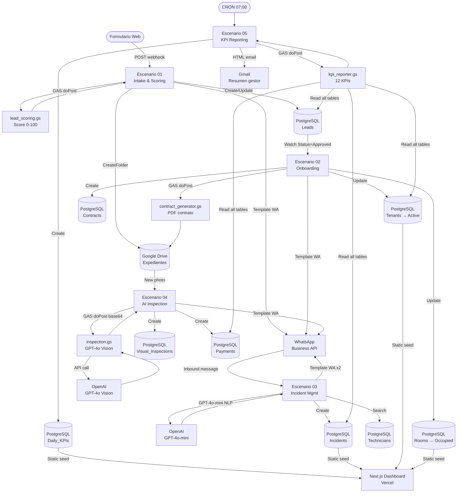
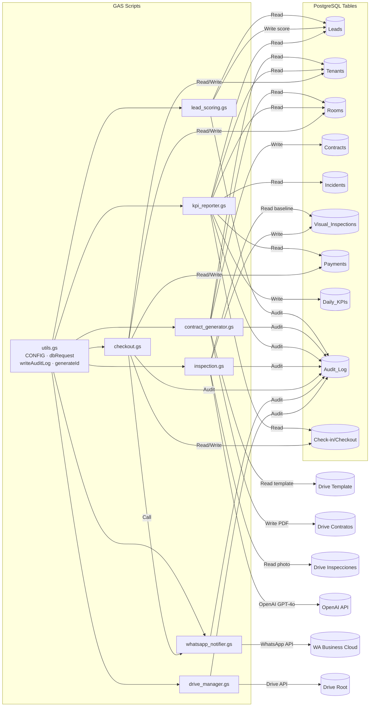

# PropertyOps AI — Arquitectura del Sistema (Diseño Objetivo)

Plataforma de automatización de ciclo completo para gestión de habitaciones en alquiler: desde la captación del candidato hasta la devolución de depósito, con IA multimodal, WhatsApp Business y dashboard en tiempo real.

> **Estado de implementación (honesto).** Este documento describe la **arquitectura objetivo
> (diseño)**, no el estado construido. Lo **implementado** en el repo es el **dashboard
> Next.js 16** con datos de demostración **estáticos** (`seed.json`) y **autenticación mock
> local** por cookie. La capa de automatización multi-servicio (Make · GAS · WhatsApp · OpenAI
> · Drive) descrita abajo es el **blueprint de diseño y NO está construida** como integraciones
> vivas. En los diagramas, la capa de persistencia objetivo se representa como **PostgreSQL**
> (base de datos relacional de producción propuesta); en el build actual esos datos viven como
> `seed.json` estático. Los diagramas representan el flujo propuesto, no el construido.

---

## Stack tecnológico

| Capa | Tecnología | Estado |
|------|-----------|--------|
| Dashboard | Next.js 16 + TypeScript + Tailwind v4 + Recharts | ✅ Implementado |
| Datos | `seed.json` estático tipado (`lib/seed.ts`) | ✅ Implementado |
| Auth | Mock local por cookie (gate `NEXT_PUBLIC_DEMO_AUTH`) | ✅ Implementado |
| Persistencia de producción (objetivo) | PostgreSQL | 📐 Diseño (no construido) |
| Orquestación | Make (Integromat) — 5 escenarios | 📐 Diseño (no construido) |
| Lógica de negocio | Google Apps Script (GAS) — 7 scripts | 📐 Diseño (no construido) |
| Documentos | Google Drive + Google Docs | 📐 Diseño (no construido) |
| Comunicación | WhatsApp Business Cloud API | 📐 Diseño (no construido) |
| IA | OpenAI GPT-4o + GPT-4o-mini | 📐 Diseño (no construido) |
| Firma electrónica | DocuSign / PandaDoc | 📐 Diseño (placeholder) |
| Despliegue | Vercel | 🎯 Objetivo |

---

## Flujo end-to-end (diseño propuesto)



---

## Dependencias entre scripts GAS



---

## Módulos y escenarios Make

| # | Escenario | Trigger | Pasos | GAS llamado |
|---|-----------|---------|-------|-------------|
| 01 | Pre-onboarding & Intake | Webhook POST form | 10 | `lead_scoring.gs` |
| 02 | Tenant Onboarding | DB Watch (Lead=Approved) | 11 | `contract_generator.gs` |
| 03 | Incident Management | WhatsApp Inbound | 12 | `whatsapp_notifier.gs` |
| 04 | AI Visual Inspection | Drive Watch (new photo) | 11 | `inspection.gs` |
| 05 | Daily KPI Reporting | CRON 07:00 | 8 | `kpi_reporter.gs` |

---

## Base de datos objetivo — PostgreSQL (16 tablas)

Ver [DATABASE.md](DATABASE.md) para el schema completo con todos los campos, tipos y relaciones.

**Relaciones clave:**
```
Properties ──< Rooms ──< Beds
               Rooms ──< Tenants ──< Contracts
               Rooms ──< Incidents ──< Technicians
               Rooms ──< Inventory_Master
               Rooms ──< Visual_Inspections ──< Check-in/Checkout
               Tenants ──< Documents
               Tenants ──< Payments
               Tenants ──< Messages_Comms
```

---

## Dashboard frontend (Next.js 16)

8 pantallas estáticas (SSG) desplegadas en Vercel:

| Ruta | Descripción |
|------|-------------|
| `/dashboard` | KPIs ejecutivos, tendencia 30 días, activity feed |
| `/onboarding` | Kanban de leads (4 columnas) con score badge |
| `/inquilinos` | Tabla de inquilinos activos con búsqueda |
| `/inquilinos/[id]` | Expediente: Resumen / Pagos / Incidencias / Docs |
| `/habitaciones` | Grid de habitaciones por propiedad |
| `/habitaciones/[id]` | Inventario checklist + historial inspecciones |
| `/incidencias` | Tabla con semáforo SLA, filtros, row expansion |
| `/checkout` | Lista de salidas + wizard 4-pasos |
| `/inspecciones` | Lista de inspecciones con AI score |
| `/inspecciones/[id]` | Slider antes/después, donut score, tabla cargos |
| `/automatizaciones` | Estado de 5 escenarios Make + error log |

---

## Seguridad y compliance

- **Secrets:** Variables de entorno en Make + `CONFIG` en GAS. Nunca en código fuente.
- **PII:** Carpetas Drive con acceso restringido por inquilino. `shareFileWithTenant()` solo añade viewer.
- **Audit trail:** Todo write/update pasa por `writeAuditLog()` en `utils.gs` → tabla `Audit_Log`.
- **Idempotencia:** Todos los escenarios Make tienen `idempotency_key` con ventana temporal y guard field en la base de datos.
- **Reintentos:** Strategy `exponential backoff` (3 intentos, inicio 2-5s) en todos los escenarios.
